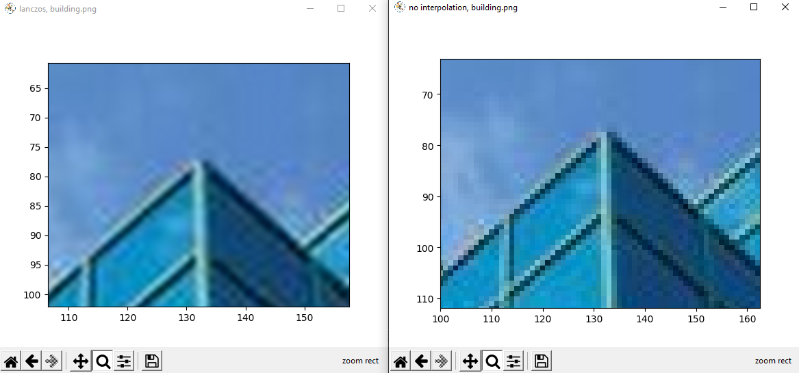

# Projeto Anti-aliasing

## Como executar o Projeto:

Dentro da raiz do projeto:


1. Crie a sua virtual env:
    ```sh
    python -m venv venv
    ```

2. Ative o virtual env (windows):
    ```sh
    .\venv\Script\activate.bat
    ```
3. Instale as dependências:
    ```sh
    pip install -r requirements.txt
    ```
4. execute o arquivo `start.py`
    ```sh
    python start.py
    ```
